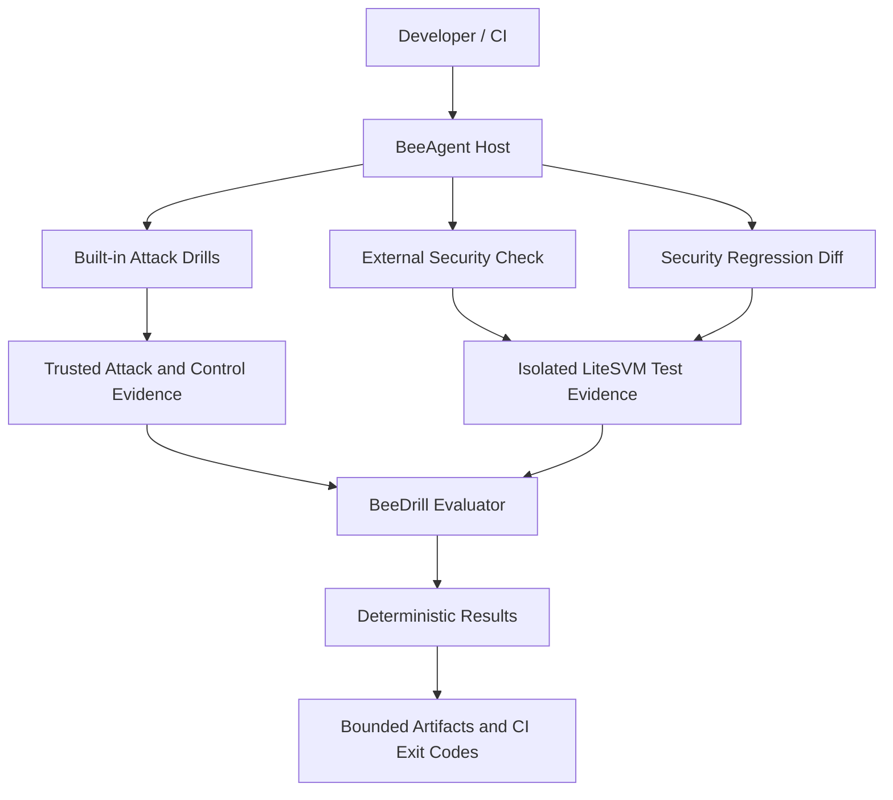

# BeeDrill — Security Regression Testing for Solana

**Audits test your code. BeeDrill tests your defenses.**

BeeDrill helps Solana developers validate security controls and catch regressions before release. It combines reproducible attack drills, isolated LiteSVM tests, deterministic results, and CI-ready evidence.

## What BeeDrill does

| Workflow                        | Purpose                                                                | Result                                                                                           |
| ------------------------------- | ---------------------------------------------------------------------- | ------------------------------------------------------------------------------------------------ |
| **Security Control Regression** | Replay supported attacks and verify detection and containment          | `PASS` / `FAIL` / `INCOMPLETE`                                                                   |
| **External Security Check**     | Execute an existing security-sensitive test against one Solana project | `test_passed` / `test_failed` / `incomplete` / `unsupported`                                     |
| **Security Regression Diff**    | Compare the same test across two versions of a Solana program          | `test_regression` / `no_test_regression` / `test_outcome_changed` / `incomplete` / `unsupported` |

**Important:** Built-in attack drills provide independently evaluated security-control verdicts for their supported scenarios. External test outcomes are developer-authored test results, not independently verified vulnerabilities.

## Quick Start

BeeDrill runs as a module in [BeeAgent](https://github.com/beesyst/beeagent). Clone BeeAgent to install and run BeeDrill using its locked dependencies.

```bash
git clone https://github.com/beesyst/beeagent.git
cd beeagent
./start.sh beedrill check
```

Expected output:

```text
BeeDrill Security Regression
PASSED: reference_target_containment_replay
PASSED: reference_oracle_manipulation_replay
PASSED: spl_token_freeze_containment_replay
Scenarios: passed=3 failed=0 incomplete=0
Suite status: PASS
```

The first run can download and prepare the required Solana toolchain. A separate BeeDrill checkout, sibling BeeSDK repository, AI API key, or Telegram account is not required.

### Requirements

For built-in drills:

- Linux x86_64 with glibc 2.34+
- Python 3.14+, Git, and a working native C toolchain
- Network access for initial installation and sufficient disk space for Solana tooling
- `uv`, which BeeAgent can bootstrap automatically

For external tests and regression comparisons:

- Node.js, verified with v22.22.1
- Bubblewrap with functional Linux user and network namespaces
- `systemd-run --user` with working cgroup-v2 memory controls
- Precompiled Solana SBF artifacts and compatible LiteSVM/Mocha/TSX test dependencies

External tests do not automatically install dependencies or compile programs.

## Security Control Regression

BeeDrill includes three reproducible security-control drills.

| Scenario                               | Attack                                          | Control              |
| -------------------------------------- | ----------------------------------------------- | -------------------- |
| `reference_target_containment_replay`  | Repeated unsafe vault withdrawals               | Vault containment    |
| `reference_oracle_manipulation_replay` | Oracle price manipulation followed by borrowing | Oracle containment   |
| `spl_token_freeze_containment_replay`  | Repeated SPL Token transfers                    | Token-account freeze |

Run all drills:

```bash
./start.sh beedrill check
```

Run a single drill:

```bash
./start.sh beedrill run --scenario reference_target_containment_replay
```

Each drill evaluates validated host observations of attack execution, detection, and containment.

Results may include detection latency (MTTD), containment latency (MTTC), gross and residual loss, and capital saved, where applicable.

- **PASS:** The supported control worked according to trusted replay evidence.
- **FAIL:** The completed replay demonstrates a failure of the supported control.
- **INCOMPLETE:** Sufficient trusted evidence could not be established.

Missing or contradictory evidence never produces `PASS`.

## External Security Check

Run an existing security-sensitive LiteSVM test against one supported Solana project.

```bash
./start.sh beedrill check --project /absolute/path/to/project
```

The project must provide an existing test, compatible dependencies, and the compiled SBF artifact loaded by that test.

Minimal supported layout:

```text
project/
├── package.json
├── pnpm-lock.yaml
├── tests/
│   └── litesvm.test.ts
├── node_modules/
│   ├── mocha/bin/mocha.js
│   ├── tsx/dist/loader.mjs
│   └── ... compatible dependencies
└── target/
    └── deploy/
        └── your_program.so
```

Additional supported Rust sources, configuration, IDL, and generated types may be present. The runner stages only the approved file layout, excludes `.git` and `.env*` content, and refuses unsafe staged symlinks and special files. A standard pnpm symlink-based dependency tree is not automatically supported.

### Results

| Classification | Meaning                                                            | Exit code |
| -------------- | ------------------------------------------------------------------ | --------- |
| `test_passed`  | A nonempty test suite completed successfully in verified isolation | `0`       |
| `test_failed`  | A nonempty test suite completed with a failing test                | `1`       |
| `incomplete`   | Execution, evidence, timeout, or cleanup could not be validated    | `3`       |
| `unsupported`  | Project layout or required runtime prerequisites are unsupported   | `3`       |

Invalid CLI arguments return exit code `2`.

A failed assertion is different from a runner failure. Neither a failed external test nor a passing external test constitutes an independent security audit.

## Security Regression Diff

Compare two compatible versions of a Solana project using the same security-sensitive test.

```bash
./start.sh beedrill diff --baseline /absolute/path/to/baseline --candidate /absolute/path/to/candidate
```

Example result:

```text
Baseline:   passed
Candidate:  failed
Result:     test_regression
Exit code:  1
```

A valid comparison requires matching test and dependency fingerprints, the same runner identity and version, completed execution, verified isolation, and successful cleanup.

The baseline and candidate may contain different program sources and compiled SBF artifacts. Their security test and dependency inputs must be identical.

| Classification         | Meaning                                                  |
| ---------------------- | -------------------------------------------------------- |
| `test_regression`      | The comparable baseline passed and candidate failed      |
| `no_test_regression`   | Comparable completed test outcomes were identical        |
| `test_outcome_changed` | Another comparable outcome change occurred               |
| `incomplete`           | Execution evidence is missing, invalid, or noncomparable |
| `unsupported`          | Project or runner prerequisites are unsupported          |

Exit code `1` identifies `test_regression`; `0` indicates a completed comparison without that regression; `2` indicates invalid CLI arguments; `3` indicates incomplete or unsupported execution.

### Real Solana example

BeeDrill has been validated against the Solana Foundation Transfer Switch example.

The original compiled SBF program rejects a restricted token transfer. An intentionally modified version permits the same transfer.

The identical LiteSVM security-sensitive test passes against the original program and fails against the modified program.

```text
Original program → test_passed
Modified program → test_failed
Comparison       → test_regression
```

The execution is performed through a generic, host-selected LiteSVM runner. Neither BeeDrill nor BeeAgent contains Transfer Switch-specific protocol logic.

The external test and compiled artifacts must be prepared before execution.

## How It Works



**BeeAgent** owns the runtime, isolated execution, resource limits, capability enforcement, and artifact storage.

**BeeDrill** owns security scenarios, evidence validation, metrics, and deterministic evaluation.

**BeeSDK** provides the shared module and capability contracts.

Optional AI assistance can explain validated findings, but cannot change security verdicts or test classifications.

## Isolation and Evidence

External LiteSVM tests execute inside a host-controlled sandbox with:

- Bubblewrap `--unshare-all` and no network access
- A restricted filesystem view and isolated environment
- Cgroup-v2 memory limits and execution timeouts
- Bounded project staging and cleanup verification
- No project-selected shell commands, installers, RPC endpoints, or signers

Missing isolation or unverifiable evidence fails closed.

Current external runner limits include 90 seconds for test execution, 30 seconds for staging, 768 MiB for process-tree memory, and 256 MiB for staged input data.

BeeDrill records execution provenance, runner identity, project/test/dependency fingerprints, isolation verification, outcomes, and cleanup status without placing raw logs or private host paths in its bounded reports.

### Reports

BeeAgent stores results under `storage/runs/`.

```text
storage/runs/<suite-id>/module-beeagent/beedrill_security_regression.json
storage/runs/<check-id>/module-beedrill/external_test_check.json
storage/runs/<diff-id>/module-beedrill/external_test_regression_diff.json
```

## CI Integration

BeeDrill commands return meaningful process exit codes and can be used as CI gates on compatible Linux runners.

```yaml
- name: Security control regression
  run: ./start.sh beedrill check
- name: External security check
  run: ./start.sh beedrill check --project "$PROJECT"
- name: Security regression diff
  run: ./start.sh beedrill diff --baseline "$BASELINE_PROJECT" --candidate "$CANDIDATE_PROJECT"
```

The required Solana toolchain, isolated execution facilities, tests, dependencies, and compiled artifacts must be available to the CI environment.

## Troubleshooting

**First run takes time:** The native Solana toolchain and test artifacts may require initial preparation.

**`unsupported`:** Verify the project path, supported layout, existing SBF binary, preinstalled dependencies, and absence of unsupported staged symlinks.

**`incomplete`:** Verify Bubblewrap, user namespaces, cgroup-v2 delegation, runner execution, timeouts, and cleanup.

**No regression detected:** Verify that the candidate actually loads its changed compiled SBF artifact and that the test and dependency fingerprints match.

## Current Limitations

BeeDrill does not automatically discover vulnerabilities, audit arbitrary Anchor projects, build third-party programs, install untrusted dependencies, or execute against production/mainnet.

The external runner currently supports a fixed LiteSVM/Mocha/TSX workflow. Developer-authored test results are not independent security verdicts.

## Documentation

- [BeeAgent — Runtime and Installation](https://github.com/beesyst/beeagent)
- [Architecture](docs/ARCHITECTURE.md)
- [Specification](docs/SPEC.md)
- [Developer Guide](docs/DEV_GUIDE.md)
- [Security Model](docs/SECURITY.md)
- [Roadmap](docs/ROADMAP.md)
- [BeeSDK](https://github.com/beesyst/beesdk)

**Audits test your code. BeeDrill tests your defenses.**
