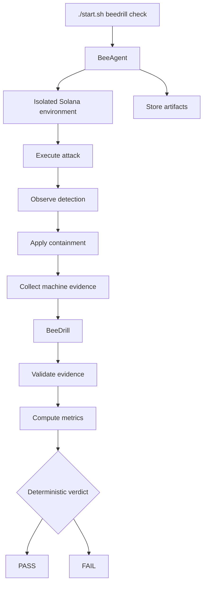

# BeeDrill — Security Regression Testing for Solana

**You regression-test your code. BeeDrill regression-tests your defenses.**

BeeDrill replays reproducible attacks against an isolated Solana environment and verifies whether detection and containment controls still work.

```text
Attack → Detect → Contain → Measure → PASS / FAIL / INCOMPLETE
```

BeeDrill answers one practical question:

> If this attack happens now, will our defenses still detect it, contain it and limit the loss?

The verdict comes from machine evidence.

- no subjective security score;
- no AI deciding PASS / FAIL;
- no mainnet execution.

## Why BeeDrill?

Audits and normal tests answer different questions.

```text
Audit
→ Can this code be exploited?

Unit / Rust tests
→ Does this code behave as expected?

BeeDrill
→ After our changes, do the defenses still stop a known attack?
```

BeeDrill turns security controls into repeatable regression tests.

```text
security-sensitive change
→ replay known attack
→ observe detection
→ exercise containment
→ measure loss
→ PASS / FAIL
→ CI / release decision
```

Use it:

- after security-sensitive changes;
- in PR / CI;
- in nightly regression runs;
- before release or deployment;
- after security remediation to replay the same attack.

## Quick start

BeeDrill runs as a module inside [BeeAgent](https://github.com/beesyst/beeagent).

### Requirements

You need:

- Linux x86_64 with glibc 2.34+ and an existing working C linker / glibc development files
- Git and Python 3.14+
- Verified preinstalled `uv`
- HTTPS access to official GitHub releases and Cargo's registry on first run
- Approximately 4 GB free user-local disk space

The recovery host prepares pinned Rust/Cargo, Solana CLI, SBF builder and Surfpool automatically. Unsupported or incompatible environments remain INCOMPLETE / exit 3; no sudo or unverified native installer scripts are used. An unchanged main checkout still requires manually prepared native tooling.

Detailed toolchain setup:

[`docs/DEV_GUIDE.md`](docs/DEV_GUIDE.md)

### Run

The uncommitted recovery host snapshot prepares checksum-verified pinned native tools automatically on supported Linux. An unchanged main clone does not include this correction yet; obtain the recovery snapshot or prepare the native prerequisites. See [`docs/DEV_GUIDE.md`](docs/DEV_GUIDE.md) for the short recovery recipe and failure diagnostics. The executable corpus remains the three built-in regressions; developer-owned protocol onboarding is not delivered.

Clone BeeAgent:

```bash
git clone https://github.com/beesyst/beeagent.git
cd beeagent
```

Run the complete BeeDrill regression suite:

```bash
./start.sh beedrill check
```

That is the primary BeeDrill command.

The current BeeAgent bootstrap automatically resolves the pinned BeeSDK and BeeDrill releases.

You do **not** need to manually:

- clone BeeSDK next to BeeAgent;
- clone BeeDrill next to BeeAgent;
- clone `beeagent-rop`;
- install BeeDrill with `pip`;
- run `uv`;
- start Surfpool separately;
- start another BeeDrill service.

## What runs?

`beedrill check` executes three approved security regressions.

| Drill                                  | Attack                                    | Defensive control        |
| -------------------------------------- | ----------------------------------------- | ------------------------ |
| `reference_target_containment_replay`  | repeated vault withdrawal                 | vault containment        |
| `reference_oracle_manipulation_replay` | oracle manipulation followed by borrowing | oracle containment       |
| `spl_token_freeze_containment_replay`  | repeated SPL Token transfer               | SPL Token account freeze |

The SPL Token drill uses the canonical SPL Token program inside the isolated Solana environment.

Each drill compares equivalent attacks under different defensive conditions.

```text
Broken control

same attack
→ containment fails
→ greater residual loss
→ FAIL
```

```text
Working control

same attack
→ containment works
→ lower residual loss
→ PASS
```

The attack stays equivalent.

The defensive control changes.

## Result

A run has three possible outcomes.

| Result       | Meaning                                                    |
| ------------ | ---------------------------------------------------------- |
| `PASS`       | the required security controls worked                      |
| `FAIL`       | the test completed, but a required security control failed |
| `INCOMPLETE` | the test could not safely complete                         |

Example:

```text
BeeDrill Security Regression
PASSED: reference_target_containment_replay
PASSED: reference_oracle_manipulation_replay
PASSED: spl_token_freeze_containment_replay
Scenarios: passed=3 failed=0 incomplete=0
Suite status: PASS
```

A security failure is different from a runtime failure.

```text
valid evidence
+
broken defense
=
FAIL
```

```text
missing / malformed evidence
or
timeout / runtime failure
=
INCOMPLETE
```

BeeDrill fails closed: missing critical evidence cannot become `PASS`.

## CI

The same command is the CI gate:

```bash
./start.sh beedrill check
```

Exit codes:

| Exit | Meaning                      |
| ---: | ---------------------------- |
|  `0` | PASS                         |
|  `1` | completed security FAIL      |
|  `2` | invalid command              |
|  `3` | INCOMPLETE / runtime failure |

Example:

```yaml
- name: BeeDrill security regression
  run: ./start.sh beedrill check
```

CI uses the process exit status. It does not need to parse console output.

## Evidence

Every run stores machine-readable evidence.

Individual scenario artifacts:

```text
storage/runs/<run-id>/module-beedrill/
```

Aggregate suite result:

```text
storage/runs/<suite-run-id>/module-beeagent/
└── beedrill_security_regression.json
```

This makes a failure:

```text
visible
→ inspectable
→ reproducible
→ replayable
```

Recorded clean-room reproduction evidence:

[`docs/evidence/reproduction.md`](docs/evidence/reproduction.md)

## What BeeDrill measures

| Metric        | Meaning                                       |
| ------------- | --------------------------------------------- |
| Detection     | did the expected detector observe the attack? |
| Containment   | did the defensive control stop or limit it?   |
| MTTD          | slots from attack start to detection          |
| MTTC          | slots from detection to containment           |
| Gross loss    | damage caused by the attack                   |
| Residual loss | damage remaining after containment            |
| Capital saved | loss prevented by the control                 |
| Verdict       | deterministic PASS / FAIL                     |

The same validated evidence produces the same metrics and the same verdict.

## How it works



Responsibility is intentionally split:

```text
BeeAgent
→ executes

BeeDrill
→ evaluates

BeeSDK
→ provides shared contracts
```

### BeeAgent owns

- Surfpool lifecycle;
- Solana RPC;
- transactions;
- subprocesses;
- ephemeral test keys;
- timeouts and cleanup;
- execution authority;
- artifact storage.

### BeeDrill owns

- scenario semantics;
- evidence validation;
- detection expectations;
- containment expectations;
- MTTD / MTTC;
- economic metrics;
- deterministic PASS / FAIL.

BeeDrill itself remains `READ_ONLY`.

## Individual drills

Most users only need:

```bash
./start.sh beedrill check
```

For debugging, individual scenarios can also be executed.

Reference vault:

```bash
./start.sh beedrill run --scenario reference_target_containment_replay
```

Oracle manipulation:

```bash
./start.sh beedrill run --scenario reference_oracle_manipulation_replay
```

SPL Token containment:

```bash
./start.sh beedrill run --scenario spl_token_freeze_containment_replay
```

## Safety

BeeDrill is designed for isolated security validation.

Current boundaries:

```text
mainnet mutation              prohibited
production credentials       not required
arbitrary RPC                prohibited
arbitrary subprocess         prohibited
arbitrary transaction input  prohibited
AI verdict authority         prohibited
```

Execution authority stays inside BeeAgent.

## AI boundary

AI assistance is optional and disabled by default.

For a completed deterministic run, BeeAgent may use validated BeeDrill facts to produce an explanation or remediation hypothesis.

AI does **not** decide:

```text
Detection
Containment
MTTD
MTTC
Loss
PASS / FAIL
```

The deterministic suite does not require an AI provider.

## Current limitation

The current executable corpus contains three built-in security regressions.

BeeDrill does **not** currently claim:

- arbitrary developer-owned protocol integration;
- arbitrary Solana RPC execution;
- arbitrary transaction execution;
- a generic scenario/plugin framework.

Developer-owned protocol integration is the next product direction:

```text
YOUR PROTOCOL
→ project-owned BeeDrill integration
→ same security-regression engine
```

## Contributor development

Sibling repositories are needed only when changing BeeDrill, BeeSDK or related source together.

Normal users and judges should use the standalone BeeAgent quickstart above.

Contributor setup is documented in:

[`docs/DEV_GUIDE.md`](docs/DEV_GUIDE.md)

## Documentation

- [`docs/DEV_GUIDE.md`](docs/DEV_GUIDE.md) — setup and development
- [`docs/SPEC.md`](docs/SPEC.md) — scenario and evidence contracts
- [`docs/ARCHITECTURE.md`](docs/ARCHITECTURE.md) — architecture boundaries
- [`docs/SECURITY.md`](docs/SECURITY.md) — execution and safety model
- [`docs/evidence/reproduction.md`](docs/evidence/reproduction.md) — recorded reproduction evidence
- [`docs/ROADMAP.md`](docs/ROADMAP.md) — product roadmap
