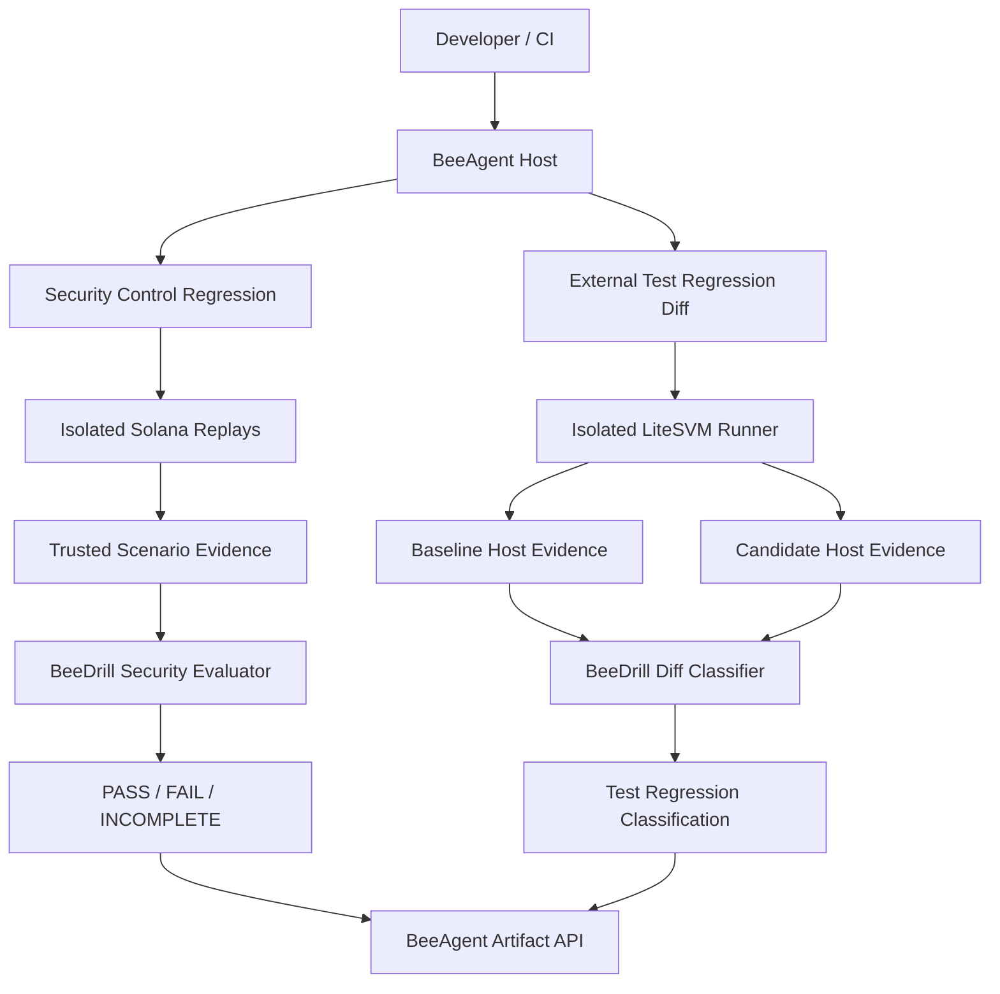

# BeeDrill — Security Regression Testing for Solana

**Audits test your code. BeeDrill tests your defenses.**

BeeDrill helps Solana developers catch security regressions before release through reproducible attack replays, bounded evidence, deterministic results, and CI integration.

**Current package version:** `0.15.0`

BeeDrill provides two workflows:

| Workflow                      | Purpose                                                       | Result                                                                                           |
| ----------------------------- | ------------------------------------------------------------- | ------------------------------------------------------------------------------------------------ |
| Security Control Regression   | Replay supported attacks and verify detection and containment | `PASS` / `FAIL` / `INCOMPLETE`                                                                   |
| External Security Check       | Run one supported LiteSVM test from a project checkout        | `test_passed` / `test_failed` / `incomplete` / `unsupported`                                     |
| External Test Regression Diff | Compare equivalent LiteSVM tests across two project versions  | `test_regression` / `no_test_regression` / `test_outcome_changed` / `incomplete` / `unsupported` |

```text
Security Control Regression
Attack → Detection → Containment → Metrics → Security Verdict

External Test Regression Diff
Baseline + Candidate → Isolated Tests → Host Evidence → Test Classification

External Security Check
Project → Isolated Test → Host Evidence → Test Classification
```

**Scope distinction:** External test failures are not independently verified exploits. BeeDrill does not manufacture security verdicts from project assertions, exit codes, or logs.

## Why BeeDrill?

A security fix may stop working after a contract upgrade, dependency change, oracle update, or control modification.

BeeDrill makes supported security checks repeatable:

1. Replay the same attack against controlled conditions.
2. Observe detection and containment behavior.
3. Validate bounded evidence.
4. Produce deterministic results.
5. Fail a CI gate when a supported regression is found.

For developer-owned LiteSVM projects, BeeDrill can run one supported test or compare tests across two code versions without introducing protocol-specific logic into its core.

## Quick start

BeeDrill runs as a domain module inside [BeeAgent](https://github.com/beesyst/beeagent).

You do not need to install a separate BeeDrill daemon or clone BeeSDK.

### Requirements

For built-in security drills:

- Linux x86_64, glibc 2.34+
- Python 3.14+
- Git
- Working native C compiler/linker and development headers
- Internet access for initial trusted dependency/toolchain preparation
- Sufficient disk space for native Solana tooling

BeeAgent's `start.sh` bootstraps `uv` when necessary and installs enabled module dependencies from its lockfile.

For external LiteSVM checks and comparisons, also provide:

- Node.js (validated with v22.22.1)
- Bubblewrap with working user/network namespaces
- `systemd-run --user` with working cgroup-v2 memory controls
- Compatible, preinstalled Mocha/TSX/LiteSVM dependencies
- A project checkout meeting the supported layout; `diff` additionally requires two prepared snapshots

The test runner does not execute package installers or download dependencies.

### Install

```bash
git clone https://github.com/beesyst/beeagent.git
cd beeagent

./start.sh beedrill check
```

The configured BeeDrill module is enabled by default.

A normal user does not need:

- A sibling `beedrill/` checkout
- A sibling `beesdk/` checkout
- A sibling `beeagent-rop/` checkout
- An OpenAI API key
- A Telegram or Bitrix account

**Release compatibility:** BeeAgent's current lock resolves BeeDrill `0.15.0`, which does not yet include the external security check. The BeeAgent maintainers must publish the synchronized BeeDrill release and lockfile before relying on this workflow from a fresh release-backed clone.

### Expected output

```text
BeeDrill Security Regression
PASSED: reference_target_containment_replay
PASSED: reference_oracle_manipulation_replay
PASSED: spl_token_freeze_containment_replay
Scenarios: passed=3 failed=0 incomplete=0
Suite status: PASS
```

These results validate the three supported security-control scenarios, not every external Solana protocol.

## Commands

Run the complete security-control suite:

```bash
./start.sh beedrill check
```

Run an individual scenario:

```bash
./start.sh beedrill run \
  --scenario reference_target_containment_replay
```

```bash
./start.sh beedrill run \
  --scenario reference_oracle_manipulation_replay
```

```bash
./start.sh beedrill run \
  --scenario spl_token_freeze_containment_replay
```

Compare two compatible versions of an external project:

```bash
./start.sh beedrill diff \
  --baseline /absolute/path/to/baseline \
  --candidate /absolute/path/to/candidate
```

Run one supported external project test:

```bash
./start.sh beedrill check --project /absolute/path/to/project
```

The project must contain `package.json`, `pnpm-lock.yaml`, `tests/litesvm.test.ts`, and preinstalled `node_modules/mocha/bin/mocha.js` and `node_modules/tsx/dist/loader.mjs`. Checkout `.git` and `.env*` entries are excluded from staging. The fixed host-selected Node/Mocha/TSX runner does not execute project scripts, installers, RPC endpoints, signers, or arbitrary commands.

All commands execute through the BeeAgent host. BeeDrill does not receive arbitrary shell, signing, RPC, or filesystem authority.

## Security Control Regression

BeeDrill currently includes three approved security drills.

| Scenario                               | Attack                                          | Control              |
| -------------------------------------- | ----------------------------------------------- | -------------------- |
| `reference_target_containment_replay`  | Repeated unsafe vault withdrawal                | Vault containment    |
| `reference_oracle_manipulation_replay` | Oracle price manipulation followed by borrowing | Oracle containment   |
| `spl_token_freeze_containment_replay`  | Repeated SPL Token transfer                     | Token-account freeze |

Each scenario uses bounded host evidence to evaluate the relevant control.

```text
Known attack
    ↓
Detection observation
    ↓
Containment action
    ↓
Post-containment observation
    ↓
Deterministic PASS / FAIL / INCOMPLETE
```

### Security metrics

Supported scenario artifacts may include:

- Detection status
- Containment status
- MTTD — detection latency measured in Solana slots
- MTTC — containment latency measured in Solana slots
- Gross loss
- Residual loss
- Capital saved
- Security verdict

These metrics describe the approved replay scenario. They are not estimates of production losses.

### Verdict meanings

| Verdict      | Meaning                                                                           |
| ------------ | --------------------------------------------------------------------------------- |
| `PASS`       | Trusted evidence shows that the required control worked in the supported scenario |
| `FAIL`       | Completed trusted evidence shows that the required control failed                 |
| `INCOMPLETE` | The host could not establish sufficient trusted evidence                          |

Missing or contradictory evidence never becomes `PASS`.

## External Test Regression Diff

This workflow is intended for developers who already have a supported LiteSVM regression test.

Suppose a program is supposed to reject a restricted transfer.

- Baseline: the transfer is rejected; the test passes.
- Candidate: the transfer succeeds unexpectedly; the same test fails.
- BeeDrill: validates comparable test-run evidence and reports `test_regression`.

No Transfer Switch-specific ABI, Program ID, PDA, transaction builder, or security policy is embedded in BeeAgent or BeeDrill.

## External Security Check

Run one existing supported LiteSVM test directly from a normal checkout:

```bash
./start.sh beedrill check --project /absolute/path/to/project
```

`test_passed` requires verified isolation, successful cleanup, a completed fixed runner, and a nonempty Mocha JSON test report. `test_failed` means that the same bounded test runner completed with a failing test outcome; it is not a runner/bootstrap failure and it is not an independent security FAIL. Missing prerequisites, a timeout, malformed evidence, or failed cleanup produce `incomplete` or `unsupported`.

### Run a comparison

Given two **prepared** project snapshots:

```bash
cd /path/to/beeagent

./start.sh beedrill diff \
  --baseline /home/user/demo/baseline \
  --candidate /home/user/demo/candidate
```

A representative result:

```json
{
  "classification": "test_regression"
}
```

The generated artifact includes both sides' runner, test, dependency, project and isolation provenance.

The required successful-baseline/failed-candidate evidence is:

```text
BASELINE                        CANDIDATE
completed                       completed
test passed                     test failed
exit code 0                     nonzero exit code
cleanup ok                      cleanup ok

Same test fingerprint
Same dependency fingerprint
Same runner identity/version
Verified isolation
```

If the test or dependency fingerprints differ, BeeDrill cannot make a comparable regression claim.

### Important: What this proves

BeeDrill can establish:

- That both supported tests were executed.
- That the baseline test passed.
- That the candidate test failed.
- That runner, test, and dependency provenance matched.
- That the runs completed through the approved isolated workflow.

It does **not** independently establish:

- A confirmed security exploit.
- On-chain economic loss in a production protocol.
- A deployed detector failure.
- A production containment failure.

For independent security PASS/FAIL on a new protocol, a separately approved invariant and trusted host observations are required.

## Using an external GitHub project

**Current support is intentionally limited.** You cannot point BeeDrill at an arbitrary Anchor repository and expect it to interpret the program, build everything, and create security tests automatically.

BeeDrill expects two prepared snapshots. It does not take a GitHub URL as a CLI argument.

### Step 1 — Obtain the source

Clone the developer's project to a separate source directory:

```bash
git clone <reviewed-external-repository-url> external-source
```

Select two reviewed Git revisions:

```text
BASELINE_REF  — known baseline version
CANDIDATE_REF — changed version
```

Create separate source exports:

```bash
mkdir -p source-baseline source-candidate

git -C external-source archive BASELINE_REF |
  tar -xf - -C source-baseline

git -C external-source archive CANDIDATE_REF |
  tar -xf - -C source-candidate
```

Replace `BASELINE_REF` and `CANDIDATE_REF` with actual reviewed Git commits or tags.

These commands prepare source exports only. They do not create runner-ready snapshots automatically.

### Step 2 — Prepare supported execution snapshots

Create separate `baseline/` and `candidate/` directories from the reviewed source exports.

Include only supported files. The current runner accepts a narrow allowlisted project layout:

```text
baseline/
├── package.json
├── pnpm-lock.yaml
├── tsconfig.json                  # optional
├── Anchor.toml                   # optional
├── Cargo.toml                    # optional
├── Cargo.lock                    # optional
├── tests/
│   └── litesvm.test.ts
├── node_modules/
│   ├── mocha/
│   │   └── bin/mocha.js
│   ├── tsx/
│   │   └── dist/loader.mjs
│   └── ... compatible dependencies
├── programs/
│   └── ... supported Rust/Cargo inputs
└── target/
    ├── deploy/
    │   └── ... program SBF artifacts
    ├── idl/
    │   └── ... supported JSON
    └── types/
        └── ... supported generated JS/TS
```

The candidate has the corresponding layout.

Requirements:

1. `tests/litesvm.test.ts` must be byte-identical.
2. The runner and Node version must be compatible.
3. Dependency and test-helper inputs must be identical.
4. The program sources and compiled program artifacts may differ.
5. The test must load the corresponding program artifact for each snapshot.
6. Dependencies must already be present before running BeeDrill.
7. Every staged input must be a supported regular file.
8. No symlinks, special files, unsupported paths, or `.git` metadata.

**A normal Git checkout is not a runner-ready directory.**

In particular:

- `.git/` is unsupported.
- A standard pnpm `node_modules` tree usually contains symlinks and is therefore unsupported.
- Unnecessary project files such as README files, workflow folders, and generated caches are not accepted.
- A changed Rust source without a matching rebuilt SBF program artifact may not change test behavior.

Build/provision the required program binaries and JavaScript dependencies through a separate reviewed, isolated preparation process. Do not execute untrusted package installers or project scripts on the host merely to prepare a BeeDrill test.

Do not include real production keys or secrets in an external test fixture. Use disposable test identities only.

### Step 3 — Run BeeDrill

```bash
cd /path/to/beeagent

./start.sh beedrill diff \
  --baseline /absolute/path/to/prepared/baseline \
  --candidate /absolute/path/to/prepared/candidate
```

Project preparation is currently a developer responsibility. BeeDrill supports the approved test execution and comparison, not automatic onboarding or compilation of arbitrary Solana projects.

### Recommended reproducible demo

For reviewers and hackathon judges, use a separately published, reviewed Transfer Switch demonstration bundle containing:

```text
transfer-switch-demo/
├── baseline/
├── candidate/
├── SHA256SUMS
└── DEMO.md
```

It should record:

- Original external project and exact Git revision references.
- The controlled program difference.
- The identical corrected LiteSVM test.
- Exact dependency and binary provenance.
- The expected baseline/candidate outcomes.
- Instructions for verifying checksums.

**A bundle URL must be added here only after the asset is actually published and independently tested.**

The demonstration data belongs outside BeeAgent/BeeDrill product code.

## External diff classifications

| Classification         | Meaning                                                                   |
| ---------------------- | ------------------------------------------------------------------------- |
| `test_regression`      | Comparable baseline passed, candidate failed                              |
| `no_test_regression`   | Comparable completed test outcomes were identical                         |
| `test_outcome_changed` | A different comparable outcome change occurred                            |
| `incomplete`           | Missing, inconsistent, non-comparable, or unsuccessful execution evidence |
| `unsupported`          | The project input or layout is unsupported                                |

`no_test_regression` does not necessarily mean both sides passed. Both tests may have failed.

### CLI exit codes

| Exit code | Meaning                                        |
| --------- | ---------------------------------------------- |
| `0`       | Completed comparison without `test_regression` |
| `1`       | `test_regression`                              |
| `2`       | Invalid CLI usage                              |
| `3`       | `incomplete` or `unsupported`                  |

Exit code `1` is **not** an independently verified security-exploit verdict.

## Execution isolation

The external runner is owned by BeeAgent.

It uses:

- One fixed host-selected LiteSVM/Mocha/TSX workflow.
- Bubblewrap `--unshare-all`.
- No external network access inside the test sandbox.
- No host HOME or environment secret mounts.
- An empty host-controlled execution environment.
- A pinned read-only source input.
- Bounded copying into a private workspace.
- A read-only staged project for test execution.
- A verified cgroup-v2 memory scope.
- Timeouts and fail-closed cleanup handling.

### Current resource limits

| Resource            | Limit      |
| ------------------- | ---------- |
| Process-tree memory | 768 MiB    |
| Swap                | Disabled   |
| Test timeout        | 90 seconds |
| Staging timeout     | 30 seconds |
| Total staged bytes  | 256 MiB    |
| Single file         | 64 MiB     |
| File count          | 10,000     |
| Directory count     | 4,096      |
| Directory depth     | 32         |

If an isolation requirement cannot be established, the external project is not executed.

The test runner does not accept project-supplied commands, executables, environment settings, network targets, signers, installers, or lifecycle scripts.

## Evidence and reports

BeeAgent stores structured artifacts under `storage/runs/`.

### Security suite

```text
storage/runs/<suite-run-id>/
└── module-beeagent/
    └── beedrill_security_regression.json
```

Individual scenario evidence is stored in its own run directory under `module-beedrill/`.

### External comparison

```text
storage/runs/<diff-run-id>/
└── module-beedrill/
    └── external_test_regression_diff.json
```

External diff evidence includes:

- Runner ID and version.
- Test and dependency fingerprints.
- Project fingerprints.
- Isolation status.
- Process outcomes.
- Exit codes and timeout status.
- Cleanup results.
- Elapsed execution time.
- Bounded diagnostic output digest.

Raw project stdout/stderr is not independent security proof.

### External security check

```text
storage/runs/<check-run-id>/
└── module-beedrill/
    └── external_test_check.json
```

The bounded report contains the fixed runner identity, test/dependency/project fingerprints, isolation and cleanup results, outcome, elapsed time, diagnostic digest, and confirmed nonzero test count. It contains no project path or raw test output.

## CI integration

### Built-in security checks

```yaml
- name: BeeDrill Security Control Regression
  run: ./start.sh beedrill check
```

### External test diff

```yaml
- name: BeeDrill External Test Regression Diff
  run: |
    ./start.sh beedrill diff \
      --baseline "$BASELINE_PROJECT" \
      --candidate "$CANDIDATE_PROJECT"
```

The CI environment must have the required Linux isolation facilities, and both project snapshots must already be prepared.

### External security check

```yaml
- name: BeeDrill External Security Check
  run: ./start.sh beedrill check --project "$PROJECT"
```

For `diff`:

- Exit `0` means the comparison completed without `test_regression`.
- Exit `1` fails the step for a detected test regression.
- Exit `3` fails the step because the result is incomplete or unsupported.

For `check --project`:

- Exit `0` means the completed nonempty test suite passed.
- Exit `1` means the completed test suite failed.
- Exit `2` means invalid CLI usage.
- Exit `3` means incomplete or unsupported execution.

## Architecture



**BeeAgent owns:** runtime, module loading, isolation, process execution, limits, cleanup, capabilities and artifacts.

**BeeDrill owns:** scenario definitions, evidence validation, security metrics, deterministic verdicts and external test-diff classification.

**BeeSDK provides:** shared module and capability interfaces.

No third-party protocol business logic is required in BeeAgent or BeeDrill core.

## Optional AI assistance

BeeAgent can optionally generate explanations and remediation guidance from bounded, validated BeeDrill security evidence.

AI assistance is disabled by default.

AI does not determine:

- Detection or containment results.
- MTTD, MTTC or economic-loss metrics.
- Security PASS/FAIL.
- External test-regression classifications.

No AI provider is required to run the deterministic workflows.

## Troubleshooting

### The installed BeeDrill release lacks external security check

Check that BeeAgent's `pyproject.toml` and `uv.lock` resolve a BeeDrill release containing `external_test_check`. The source checkout's version does not override the host's pinned installed package automatically; use the documented `PYTHONPATH` command for coordinated source development until the synchronized release is available.

### `unsupported`

Check:

- The project path is absolute and canonical.
- Every staged file is regular and supported.
- There are no symlinks; checkout `.git` and `.env*` entries are excluded from staging.
- `tests/litesvm.test.ts` exists.
- Mocha, TSX, LiteSVM and transitive dependencies are present.
- The snapshot fits the input bounds.

### `incomplete`

Check:

- The approved sandbox is available.
- User/network namespaces work.
- cgroup-v2 user scopes work.
- Both executions completed.
- Runner, test and dependency evidence is comparable.
- Cleanup succeeded.

Never treat `incomplete` as a passing security check.

### Bubblewrap or cgroup unavailable

The host must support the required namespace and user-scope isolation. BeeDrill deliberately refuses unisolated external code execution.

### The candidate changed, but no regression was detected

Verify that:

- The test covers the changed behavior.
- The candidate actually uses the modified compiled program artifact.
- Both tests and dependencies are equivalent.
- You inspect the JSON `classification`, not only the exit code.

## Current limitations

BeeDrill currently supports:

- Three built-in security-control drills.
- One fixed external LiteSVM/Mocha/TSX single-project check workflow.
- One fixed external LiteSVM/Mocha/TSX test-diff workflow.
- Bounded evidence and deterministic reporting.
- CLI and CI integration.

It does not yet support:

- Automatic vulnerability discovery.
- Universal auditing of arbitrary Solana protocols.
- Arbitrary Anchor ABI interpretation.
- Automatic project compilation or dependency installation.
- Project-selected executors.
- Production/mainnet attack execution.
- Independent security verdicts for arbitrary external contracts.

These limitations are intentional and must not be hidden when demonstrating the MVP.

## Contributor development

Develop BeeDrill as a separate Python package:

```bash
git clone https://github.com/beesyst/beedrill.git
cd beedrill

uv sync
uv run pytest -q
uv build
```

The development environment uses the BeeSDK source specified by the repository. Contributors must follow the corresponding workspace requirements.

To test a local BeeDrill checkout against a compatible BeeAgent host:

```bash
cd /path/to/beeagent

PYTHONPATH=/path/to/beedrill/src \
  ./start.sh beedrill check
```

A normal release-backed installation should not require local sibling source checkouts.

## Documentation

- [Development guide](docs/DEV_GUIDE.md)
- [Specification](docs/SPEC.md)
- [Architecture](docs/ARCHITECTURE.md)
- [Security model](docs/SECURITY.md)
- [Reproduction evidence](docs/evidence/reproduction.md)
- [Roadmap](docs/ROADMAP.md)

## Repositories

- [BeeDrill](https://github.com/beesyst/beedrill)
- [BeeAgent](https://github.com/beesyst/beeagent)
- [BeeSDK](https://github.com/beesyst/beesdk)

**BeeDrill turns known security failures into repeatable checks, helping developers catch regressions before release.**
