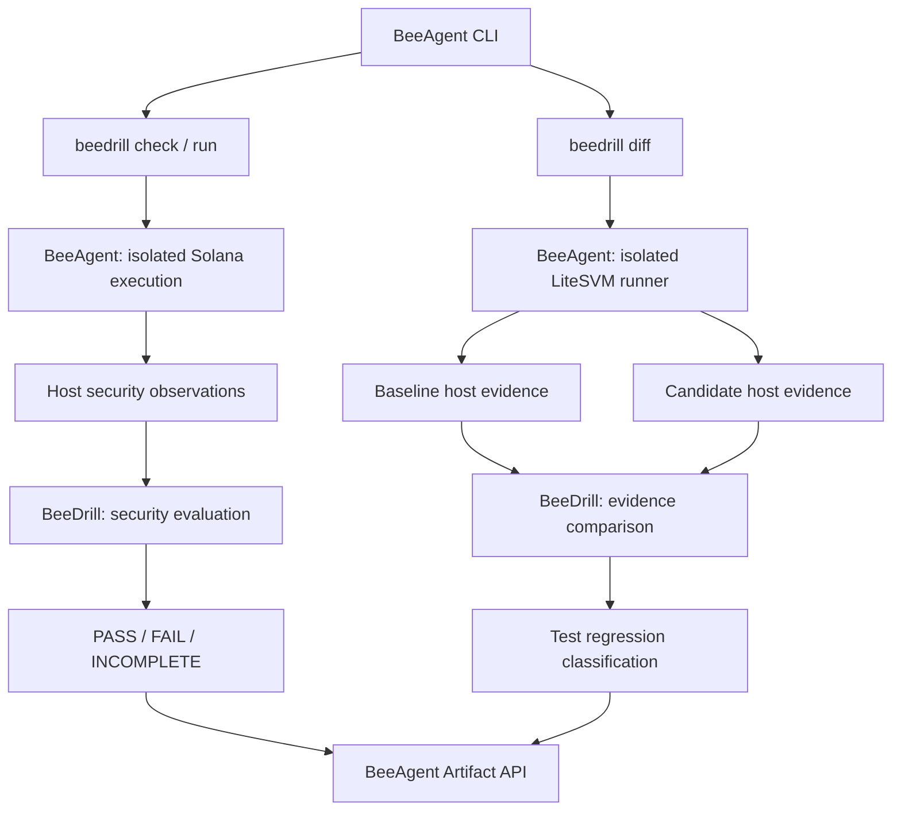

# BeeDrill — Security Regression Testing for Solana

**Audits find vulnerabilities. BeeDrill tests whether known security failures come back.**

BeeDrill helps Solana developers validate security controls through reproducible attack replays, deterministic evidence, and automated regression checks.

It supports two complementary workflows:

- **Security Control Regression:** replay approved attacks and verify detection, containment, and loss metrics.
- **External Test Regression Diff:** run equivalent LiteSVM tests against two versions of a developer's project and detect changed test outcomes.

```text
Security Control Regression
Attack → Detection → Containment → Metrics → PASS / FAIL / INCOMPLETE

External Test Regression Diff
Baseline + Candidate → Isolated tests → Comparable evidence → TEST_REGRESSION
```

**Important:** an external test regression is not a verified security exploit. Security PASS/FAIL requires independently established security invariants and trusted observations.

## Why BeeDrill?

Smart contract audits, unit tests, and security regression testing answer different questions.

| Approach                      | Question                                                      |
| ----------------------------- | ------------------------------------------------------------- |
| Security audit                | Can the code be exploited?                                    |
| Unit and integration tests    | Does the code behave as expected?                             |
| BeeDrill security drills      | Do approved defenses still detect and contain a known attack? |
| BeeDrill Test Regression Diff | Did equivalent tests start failing after the project changed? |

Security fixes should not be treated as permanent guarantees.

A change to a contract, token program integration, oracle dependency, or defense mechanism may reintroduce a previously resolved failure.

BeeDrill makes supported security checks repeatable:

```text
Change code
    ↓
Run regression
    ↓
Validate evidence
    ↓
Detect a failure
    ↓
Inspect the result
    ↓
Fix before release
```

BeeDrill is designed for local development, CI pipelines, and pre-release validation.

## Quick start

BeeDrill runs as a module inside [BeeAgent](https://github.com/beesyst/beeagent).

### Requirements

For the built-in security regression suite:

- Linux x86_64, glibc 2.34+
- Python 3.14+
- Git and `uv`
- Working native Rust/Cargo, Solana and C-linker prerequisites
- Sufficient local disk space for the native toolchain and isolated execution

Refer to [the development guide](docs/DEV_GUIDE.md) for native-toolchain preparation and supported environments.

For external LiteSVM Test Regression Diff, additional requirements apply:

- Node.js — validated with v22.22.1
- Bubblewrap with working user/network namespaces
- `systemd-run --user` with functional cgroup-v2 memory limits
- Preinstalled compatible Mocha, TSX, LiteSVM and transitive dependencies
- A supported regular-file project layout without symlinks

External tests run offline. BeeDrill does not download packages or run project installers inside the test sandbox.

### Install and run

Once matching BeeAgent and BeeDrill revisions are released:

```bash
git clone https://github.com/beesyst/beeagent.git
cd beeagent

./start.sh beedrill check
```

BeeAgent's bootstrap resolves the configured BeeDrill module and pinned BeeSDK dependency.

No separate BeeDrill daemon, manual BeeSDK clone, ROP installation, or AI provider is required.

The first run may require network access to prepare the Python environment and native development dependencies.

**Release status:** Security Regression Diff is implemented in BeeDrill Issue #51 and BeeAgent Issue #295 feature branches. Until those changes are merged and BeeAgent's pinned BeeDrill revision is updated, the public `main` checkout is not guaranteed to provide the new `diff` command.

## Commands

### 1. Run all security controls

```bash
./start.sh beedrill check
```

This runs all three built-in security regression scenarios.

Expected successful output:

```text
BeeDrill Security Regression
PASSED: reference_target_containment_replay
PASSED: reference_oracle_manipulation_replay
PASSED: spl_token_freeze_containment_replay
Scenarios: passed=3 failed=0 incomplete=0
Suite status: PASS
```

These are actual supported security-control checks, not arbitrary tests against an unknown external protocol.

### 2. Run one security scenario

Vault containment:

```bash
./start.sh beedrill run --scenario reference_target_containment_replay
```

Oracle manipulation:

```bash
./start.sh beedrill run --scenario reference_oracle_manipulation_replay
```

SPL Token freeze containment:

```bash
./start.sh beedrill run --scenario spl_token_freeze_containment_replay
```

### 3. Compare two versions of an external project

```bash
./start.sh beedrill diff \
  --baseline /absolute/path/to/baseline \
  --candidate /absolute/path/to/candidate
```

BeeAgent runs one fixed LiteSVM/Mocha/TSX workflow against both project snapshots.

BeeDrill compares the host-generated evidence and reports whether their test outcomes changed.

No third-party protocol-specific execution logic is added to BeeAgent or BeeDrill.

## External Test Regression Diff

This is the first external-project workflow.

Consider a developer maintaining an Anchor program with a security-sensitive transfer restriction.

The developer has:

- a baseline implementation;
- a modified candidate implementation;
- the same LiteSVM regression test in both versions.

The test expects an operation to be rejected.

After changing the contract, the operation is no longer rejected and the test fails.

BeeDrill detects that regression.

### Example

```bash
./start.sh beedrill diff \
  --baseline /projects/transfer-baseline \
  --candidate /projects/transfer-candidate
```

Representative result:

```json
{
  "classification": "test_regression",
  "baseline": {
    "outcome": "passed",
    "exit_code": 0,
    "execution_status": "completed",
    "cleanup": "ok"
  },
  "candidate": {
    "outcome": "failed",
    "exit_code": 1,
    "execution_status": "completed",
    "cleanup": "ok"
  }
}
```

The actual artifact also records runner, test, dependency, project, and isolation provenance.

**What BeeDrill established:**

- the host ran both supported tests;
- the baseline test passed;
- the candidate test failed;
- the runner and comparable test/dependency identities matched;
- both runs completed in the approved isolated environment.

**What BeeDrill did not establish:**

- an independently verified on-chain exploit;
- actual production loss;
- a deployed security detector failure;
- a verified containment failure in the developer's protocol.

A test exit code is not independent security evidence.

### Supported project layout

The current runner accepts one reviewed, fixed layout, including:

```text
project/
├── package.json
├── pnpm-lock.yaml
├── tests/
│   └── litesvm.test.ts
├── node_modules/
│   ├── mocha/
│   │   └── bin/mocha.js
│   └── tsx/
│       └── dist/loader.mjs
├── programs/
│   └── ... supported Rust/Cargo sources
└── target/
    ├── deploy/
    ├── idl/
    └── types/
```

Other project files are accepted only where the runner's allowlist permits them.

Rules:

- Both roots must be canonical absolute paths.
- Symlinks and special files are rejected.
- Test and dependency identities must match.
- Supported target inputs may differ.
- Dependencies must already be present as regular files.
- Project-selected scripts, commands, installers, executable paths, and network destinations are not permitted.
- Unsupported framework or layout results in `unsupported` or `incomplete`, not a fabricated regression.

**This is not a generic "point BeeDrill at any Anchor repository" interface.** Developers currently need to prepare compatible project snapshots.

### Isolation and resource limits

The external runner uses:

- Bubblewrap `--unshare-all`;
- no external network namespace access;
- no host HOME or production secret mounts;
- an empty, host-controlled environment;
- FD-pinned read-only source input;
- bounded staging into a disposable private workspace;
- a read-only staged project during test execution;
- cgroup-v2 memory limits;
- explicit timeout and process cleanup;
- host-generated bounded evidence.

Current execution limits include:

| Resource                    | Bound             |
| --------------------------- | ----------------- |
| Sandbox process-tree memory | 768 MiB           |
| Swap                        | Disabled          |
| Test timeout                | 90 seconds        |
| Staging timeout             | 30 seconds        |
| Input files                 | 10,000 maximum    |
| Aggregate input bytes       | 256 MiB maximum   |
| Individual input file       | 64 MiB maximum    |
| Input directories           | 4,096 maximum     |
| Input depth                 | 32 levels maximum |

If the required execution isolation cannot be established, the host fails closed.

## Test Diff classifications

| Classification         | Meaning                                                                  |
| ---------------------- | ------------------------------------------------------------------------ |
| `test_regression`      | Comparable baseline passed; candidate failed                             |
| `no_test_regression`   | Comparable completed outcomes are identical                              |
| `test_outcome_changed` | Other comparable completed outcome change                                |
| `incomplete`           | Missing, inconsistent, noncomparable, or unsuccessful execution evidence |
| `unsupported`          | Unsupported project input or layout                                      |

Only completed, validated host evidence can produce a completed comparison classification.

`no_test_regression` does not mean both projects passed: both may have failed the same test.

### Diff command exit codes

| Exit | Meaning                                                |
| ---- | ------------------------------------------------------ |
| `0`  | No test regression or another completed outcome change |
| `1`  | `test_regression`                                      |
| `2`  | Invalid CLI usage                                      |
| `3`  | Incomplete or unsupported execution                    |

Exit code `1` here means **test regression**, not a confirmed security vulnerability.

Inspect the JSON classification when the distinction between unchanged and other changed outcomes matters.

## Built-in security regression scenarios

The supported security suite contains three approved drills.

| Scenario                               | Attack                                   | Control                  |
| -------------------------------------- | ---------------------------------------- | ------------------------ |
| `reference_target_containment_replay`  | Repeated unsafe vault withdrawal         | Vault containment        |
| `reference_oracle_manipulation_replay` | Manipulated oracle followed by borrowing | Oracle containment       |
| `spl_token_freeze_containment_replay`  | Repeated token transfer                  | SPL Token account freeze |

These drills compare equivalent attack conditions against different defensive states.

### Broken control

```text
Attack succeeds
    ↓
Detection evidence collected
    ↓
Containment ineffective
    ↓
Additional residual loss
    ↓
Security FAIL
```

### Working control

```text
Same attack
    ↓
Detection evidence collected
    ↓
Containment effective
    ↓
Reduced residual loss
    ↓
Security PASS
```

The evaluator uses validated scenario evidence rather than AI confidence or free-form logs.

### Security verdicts

| Verdict      | Meaning                                                                          |
| ------------ | -------------------------------------------------------------------------------- |
| `PASS`       | Required security controls were validated as effective in the supported scenario |
| `FAIL`       | Completed trusted evidence shows a required security control failed              |
| `INCOMPLETE` | The check could not produce sufficient trustworthy evidence                      |

Missing critical evidence never becomes PASS.

## Security metrics

The built-in drills compute supported metrics from validated evidence.

| Metric           | Meaning                                                     |
| ---------------- | ----------------------------------------------------------- |
| Detection        | Whether the expected detector observed the attack           |
| Containment      | Whether the defensive control stopped or limited the attack |
| MTTD             | Solana slots from attack start to detection                 |
| MTTC             | Solana slots from detection to containment                  |
| Gross loss       | Damage caused by the attack in the scenario                 |
| Residual loss    | Damage remaining after containment                          |
| Capital saved    | Loss prevented by the effective control                     |
| Security verdict | Deterministic PASS / FAIL / INCOMPLETE                      |

These metrics belong to the approved security scenarios.

The external Test Regression Diff does **not** generate synthetic detection, containment, or economic-loss metrics.

## Architecture

BeeDrill separates host execution from deterministic security evaluation.



### BeeAgent owns

- runtime and module loading;
- execution authority;
- Solana runtime and approved host capabilities;
- isolated external test execution;
- subprocesses, resource limits and cleanup;
- artifact storage and CLI integration.

### BeeDrill owns

- security scenario semantics;
- evidence validation;
- detection and containment evaluation;
- security metrics;
- deterministic security verdicts;
- external test-regression classification.

### BeeSDK provides

- module contracts;
- capability result contracts;
- shared artifact interfaces.

BeeDrill remains a read-only domain module. It does not gain arbitrary shell, RPC, wallet or filesystem execution authority.

## CI integration

### Security-control regression gate

```yaml
- name: BeeDrill security controls
  run: ./start.sh beedrill check
```

For the built-in security suite:

- `0` = PASS
- `1` = security FAIL
- `2` = invalid CLI usage
- `3` = INCOMPLETE

### External test regression gate

```yaml
- name: BeeDrill external test diff
  run: |
    ./start.sh beedrill diff \
      --baseline "$BASELINE_PROJECT" \
      --candidate "$CANDIDATE_PROJECT"
```

Both environment variables must contain canonical absolute paths to prepared supported project snapshots.

The CI runner must provide approved Bubblewrap and cgroup isolation.

`test_regression` exits with status `1` and fails the CI step.

`incomplete` and `unsupported` also fail the step.

## Evidence and artifacts

BeeAgent persists structured machine-readable artifacts.

### Built-in security scenarios

```text
storage/
└── runs/
    ├── <scenario-run-id>/
    │   └── module-beedrill/
    │       └── <scenario-name>.json
    └── <suite-run-id>/
        └── module-beeagent/
            └── beedrill_security_regression.json
```

### External regression comparison

```text
storage/
└── runs/
    └── <diff-run-id>/
        └── module-beedrill/
            └── external_test_regression_diff.json
```

Evidence includes bounded execution provenance and outcomes.

Raw external project output is diagnostic-only and is not treated as independently verified security evidence.

Recorded clean-room evidence for the built-in suite is described in [reproduction.md](docs/evidence/reproduction.md).

## Optional AI explanations

BeeDrill security verdicts are deterministic.

BeeAgent can optionally generate explanation and remediation text from bounded, validated facts.

AI assistance is disabled by default.

AI does not decide:

- detection;
- containment;
- MTTD or MTTC;
- economic-loss metrics;
- security PASS / FAIL;
- external test-regression classifications.

The deterministic workflows work without an AI provider.

## Current limitations

BeeDrill currently provides:

- three built-in security-control scenarios;
- one fixed external LiteSVM Test Regression Diff workflow;
- bounded evidence and deterministic reporting;
- CLI and CI integration.

BeeDrill does not currently provide:

- automatic discovery of vulnerabilities;
- universal auditing of arbitrary Solana protocols;
- automatic interpretation of arbitrary Anchor ABIs;
- arbitrary project-selected test executors;
- unrestricted RPC execution;
- production or mainnet attack execution;
- independent security verdicts for arbitrary developer-owned projects;
- automatic onboarding of every Solana framework.

The supported external comparison workflow is a foundation for broader developer adoption, not a claim of universal protocol support.

## Contributor development

BeeDrill is developed as an independent Python package.

Source development:

```bash
git clone https://github.com/beesyst/beedrill.git
cd beedrill

uv sync
uv run pytest -q
uv build
```

No BeeDrill-local daemon or independent execution CLI is provided.

For coordinated development of BeeDrill and BeeAgent feature branches, use their reviewed local worktrees. Before their releases are synchronized, BeeAgent can select the local BeeDrill source explicitly:

```bash
cd /path/to/beeagent

PYTHONPATH=/path/to/beedrill/src \
  ./start.sh beedrill check
```

The same local source selection applies to `beedrill diff`.

Normal release-backed users should not need sibling repositories once compatible releases are pinned.

## Documentation

- [Development guide](docs/DEV_GUIDE.md)
- [Product and evidence specification](docs/SPEC.md)
- [Architecture](docs/ARCHITECTURE.md)
- [Security model](docs/SECURITY.md)
- [Reproduction evidence](docs/evidence/reproduction.md)
- [Roadmap](docs/ROADMAP.md)

## Project

- [BeeDrill](https://github.com/beesyst/beedrill)
- [BeeAgent](https://github.com/beesyst/beeagent)
- [BeeSDK](https://github.com/beesyst/beesdk)

**BeeDrill turns supported security failures into reproducible regression checks, so developers can catch regressions before release.**
