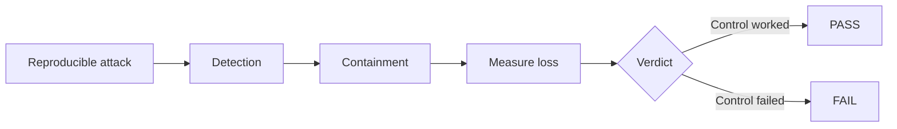
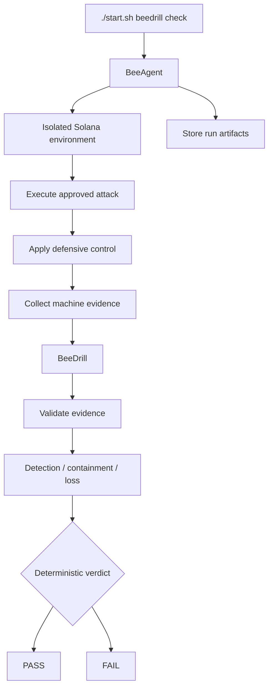

# BeeDrill — Security Regression Testing for Solana

# You regression-test your code. BeeDrill regression-tests your defenses.

BeeDrill is for Solana protocol and security teams. It replays approved attacks
against an isolated local environment and deterministically verifies whether
detection and containment still limit loss.

```text
Attack → Detect → Contain → Measure → PASS / FAIL
```

BeeDrill answers one practical question:

> If this attack happens now, will our real defenses detect it, contain it and limit the loss?

The verdict comes from machine evidence.

No subjective security score.  
No AI deciding PASS / FAIL.  
No mainnet execution.

## What BeeDrill does

A protocol may already have audits, alerts, monitoring and emergency controls.

That does not prove those controls still work.

BeeDrill turns them into repeatable security regression tests.



The same idea as normal regression testing:

```text
code change
→ tests
→ PASS / FAIL

security-sensitive change
→ BeeDrill
→ attack replay
→ PASS / FAIL
```

## Why BeeDrill?

| You have               | BeeDrill verifies                                   |
| ---------------------- | --------------------------------------------------- |
| Audit                  | whether the defenses still work now                 |
| Alert                  | whether the attack actually triggers detection      |
| Pause / freeze control | whether it actually stops the next malicious action |
| Security assumption    | whether machine evidence proves it                  |
| Manual test            | whether it can be replayed automatically            |
| Risk score             | deterministic PASS / FAIL                           |

BeeDrill complements audits rather than replacing them.

```text
Audit
→ Can this code be exploited?

BeeDrill
→ If an attack happens, do the defenses actually stop it?
```

## Judge quickstart: reproducibility proof

This is a proof/reproduction path for judges, not the usual end-user workflow.
Teams run BeeDrill after security-sensitive changes, in PR/CI, nightly, before
a release or deploy, and after remediation to replay the exact attack.

BeeDrill is a module for [BeeAgent](https://github.com/beesyst/beeagent).

BeeAgent is the runtime.

BeeDrill does not start a second service and does not manage Solana execution
itself.

### 1. Requirements

You need:

- Linux
- Git
- Python 3.14+
- Rust / Cargo
- Solana CLI
- `cargo-build-sbf`
- Surfpool

BeeAgent bootstraps `uv` automatically.

Detailed toolchain setup is documented in
[`docs/DEV_GUIDE.md`](docs/DEV_GUIDE.md).

### 2. Clone BeeAgent and run

```bash
git clone https://github.com/beesyst/beeagent.git
cd beeagent
./start.sh beedrill check
```

The tracked BeeAgent configuration already enables the `beedrill` extra. Its
normal bootstrap resolves pinned BeeSDK and BeeDrill release revisions; no
sibling `beesdk`, `beedrill`, or `beeagent-rop` checkout, manual `pip install`,
or separate BeeDrill installer is required.

This is the primary BeeDrill command.

BeeAgent prepares the environment, starts the isolated runtime, executes the
drills and stores the evidence.

You do not need to manually:

- install BeeDrill with `pip`;
- run `uv`;
- start Surfpool separately;
- start another BeeDrill process.

### Contributor source development

Clone BeeDrill and BeeSDK as sibling repositories only when changing their
source. The normal judge/user quickstart above deliberately does not use that
layout. See [`docs/DEV_GUIDE.md`](docs/DEV_GUIDE.md) for the contributor setup.

## How it works



The responsibility boundary is simple:

```text
BeeAgent
→ executes

BeeDrill
→ evaluates

BeeSDK
→ connects both through shared contracts
```

BeeAgent owns:

- Surfpool;
- Solana RPC;
- transactions;
- subprocesses;
- ephemeral test keys;
- timeouts;
- cleanup;
- runtime authority;
- artifacts.

BeeDrill owns:

- attack scenario semantics;
- evidence validation;
- detection expectations;
- containment expectations;
- MTTD / MTTC;
- economic metrics;
- deterministic PASS / FAIL.

## Current security regressions

`beedrill check` currently executes three approved drills.

| Drill                                  | Attack                                    | Defensive control        |
| -------------------------------------- | ----------------------------------------- | ------------------------ |
| `reference_target_containment_replay`  | repeated vault withdrawal                 | vault containment        |
| `reference_oracle_manipulation_replay` | oracle manipulation followed by borrowing | oracle containment       |
| `spl_token_freeze_containment_replay`  | repeated SPL Token transfer               | SPL Token account freeze |

The SPL Token drill uses the canonical SPL Token program inside the isolated
Solana environment.

## What is a regression?

Every drill compares equivalent attacks under different defensive conditions.

Broken defense:

```text
same attack
→ detection
→ containment fails
→ higher residual loss
→ FAIL
```

Fixed defense:

```text
same attack
→ detection
→ containment works
→ lower residual loss
→ PASS
```

The attack stays equivalent.

The defense changes.

That difference is the security regression.

## Result

A run has three possible outcomes.

| Result       | Meaning                                           |
| ------------ | ------------------------------------------------- |
| `PASS`       | the security controls worked                      |
| `FAIL`       | the test completed, but a security control failed |
| `INCOMPLETE` | the test could not safely complete                |

Example:

```text
BeeDrill Security Regression

PASS: reference_target_containment_replay
PASS: reference_oracle_manipulation_replay
PASS: spl_token_freeze_containment_replay

Scenarios: passed=3 failed=0 incomplete=0
Suite status: PASS
```

A security failure is not the same as a runtime error.

```text
valid evidence
+
broken defense
=
FAIL
```

```text
missing / malformed evidence
or
timeout / runtime failure
=
INCOMPLETE
```

BeeDrill fails closed.

Missing critical evidence can never become PASS.

## What BeeDrill measures

| Metric        | Meaning                                              |
| ------------- | ---------------------------------------------------- |
| Detection     | did the expected detector observe the attack?        |
| Containment   | did the defensive control actually stop or limit it? |
| MTTD          | slots from attack start to detection                 |
| MTTC          | slots from detection to containment                  |
| Gross loss    | damage caused by the attack                          |
| Residual loss | damage remaining after containment                   |
| Capital saved | loss prevented by the control                        |
| Verdict       | deterministic PASS / FAIL                            |

Example:

```text
Attack executed      PASS
Detection            PASS
Containment          FAIL
MTTD                  4 slots
MTTC                  unavailable
Residual loss         480000 units
Final verdict         FAIL
```

The same validated evidence produces the same metrics and the same verdict.

## CI

The local command is also the CI command:

```bash
./start.sh beedrill check
```

Exit codes:

| Exit | Meaning                      |
| ---: | ---------------------------- |
|  `0` | PASS                         |
|  `1` | completed security FAIL      |
|  `2` | invalid command              |
|  `3` | INCOMPLETE / runtime failure |

Example:

```yaml
- name: BeeDrill security regression
  run: ./start.sh beedrill check
```

CI does not need to parse console output.

The exit code is the gate.

## Evidence

BeeDrill keeps machine-readable evidence for every run.

Individual scenario results:

```text
beeagent/storage/runs/<run-id>/module-beedrill/
```

Aggregate result:

```text
beeagent/storage/runs/<suite-run-id>/module-beeagent/
└── beedrill_security_regression.json
```

That makes a failure:

```text
visible
→ inspectable
→ reproducible
→ replayable
```

## Individual drills

Most users only need:

```bash
./start.sh beedrill check
```

Individual scenarios are available for debugging.

Reference vault:

```bash
./start.sh beedrill run --scenario reference_target_containment_replay
```

Oracle manipulation:

```bash
./start.sh beedrill run --scenario reference_oracle_manipulation_replay
```

SPL Token containment:

```bash
./start.sh beedrill run --scenario spl_token_freeze_containment_replay
```

These commands are additional CLI tools.

The primary product flow remains:

```bash
./start.sh beedrill check
```

## Safety

BeeDrill is designed for isolated security validation.

Current boundaries:

```text
mainnet mutation              prohibited
production credentials       not required
arbitrary RPC                prohibited
arbitrary subprocess         prohibited
arbitrary transaction input  prohibited
AI verdict authority         prohibited
```

BeeDrill itself remains `READ_ONLY`.

Execution authority remains inside BeeAgent.

## AI boundary

BeeAgent may optionally request an AI explanation for completed validated
BeeDrill facts. It is disabled by default; the deterministic core works without
an AI provider and no provider call is required for the judge command.

AI does not decide:

```text
Detection
Containment
MTTD
MTTC
Loss
PASS / FAIL
```

Critical security truth comes from validated machine evidence.

## Current limitation and next direction

The current executable corpus is the three approved built-in security
regressions. BeeDrill does not claim arbitrary developer-owned protocol,
arbitrary RPC, or generic adapter compatibility.

Developer-owned protocol integration is a post-hackathon direction:

```text
YOUR PROTOCOL
→ project-owned BeeDrill integration
→ same security-regression engine
```

No external developer dogfood session has been recorded for this release. When
one is available, its time-to-first-result, blockers, and confusing steps will
be recorded as evidence rather than inferred.

## Current status

The MVP loop works end to end:

```text
Define
→ Isolate
→ Attack
→ Detect
→ Contain
→ Measure
→ Verdict
→ Replay
```

Available now:

- isolated Solana attack execution;
- reproducible attack scenarios;
- machine-verifiable detection;
- real containment controls;
- economic loss measurement;
- deterministic PASS / FAIL;
- real SPL Token freeze containment;
- aggregate security regression gate;
- CI exit semantics;
- replayable evidence;
- fail-closed runtime behavior.

BeeDrill is currently **Solana-first** and focused specifically on continuous
security-control validation.

It is not intended to be a generic vulnerability scanner, SIEM or generic
blockchain execution framework.

## Documentation

- [`docs/DEV_GUIDE.md`](docs/DEV_GUIDE.md) — environment and toolchain setup
- [`docs/SPEC.md`](docs/SPEC.md) — scenario and evidence contracts
- [`docs/ARCHITECTURE.md`](docs/ARCHITECTURE.md) — architecture boundaries
- [`docs/SECURITY.md`](docs/SECURITY.md) — execution and safety model
- [`docs/ROADMAP.md`](docs/ROADMAP.md) — product roadmap
