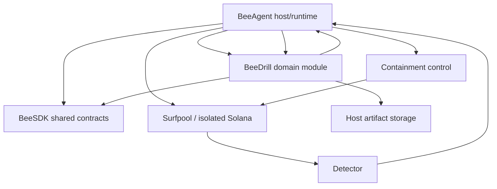

# ARCHITECTURE — BeeDrill

## Idea

`beedrill` is a focused Python package for continuous security-control validation
of Solana protocols.

BeeDrill answers a narrower question than an audit or vulnerability scanner:

> When a reproducible attack occurs, do the protocol's actual defenses detect
> it, contain it, and limit economic damage?

The target product flow is:

```text
current protocol state
→ isolated Solana environment
→ deterministic attack scenario
→ attack execution
→ detection observation
→ containment observation
→ economic outcome measurement
→ deterministic PASS / FAIL
```

BeeDrill is a domain module, not a runtime.

The canonical architecture is:

```text
BeeSDK
  shared contracts
      ↑
BeeAgent
  host / runtime / orchestration / execution
      ↑
BeeDrill
  scenarios / evidence / metrics / verdicts
```

Main rule:

> BeeDrill defines what a security drill means. BeeAgent owns how bounded
> execution happens.

## Core principle

The correct execution model is:

```text
BeeDrill
  defines drill intent
      ↓
BeeAgent
  validates policy and authority
      ↓
BeeAgent-owned execution boundary
      ↓
isolated Solana environment
      ↓
bounded evidence
      ↓
BeeDrill
  validates evidence
  computes metrics
  returns deterministic verdict
```

BeeDrill must not bypass BeeAgent merely because direct subprocess or RPC access
would be easier to implement.

## Product boundary

BeeDrill owns security-control validation.

It is not primarily:

- a vulnerability scanner;
- a generic AI pentester;
- a generic Solana simulator;
- a SIEM;
- a SOC platform;
- an incident-response chatbot;
- a generic workflow engine;
- a multi-chain security framework;
- a hosted runner fleet;
- a marketplace.

The hackathon MVP focuses on proving the core validation loop for Solana.

## What lives in BeeDrill

BeeDrill owns domain behavior required to describe and evaluate a drill.

This includes:

- drill-specific target semantics;
- scenario identity and semantics;
- attack expectations;
- expected detector behavior;
- expected containment behavior;
- evidence validation;
- evidence interpretation;
- MTTD semantics;
- MTTC semantics;
- residual-loss semantics;
- deterministic verdict rules;
- scenario fixtures and regression corpus;
- BeeDrill-specific result and report semantics.

Concrete domain contracts should be introduced only by the roadmap iteration
that needs them.

Do not prebuild an abstract scenario framework before real scenarios require it.

## What does not live in BeeDrill

BeeDrill must not own:

- generic runtime orchestration;
- module registry;
- run/session lifecycle;
- generic subprocess execution;
- unrestricted shell execution;
- Surfpool process lifecycle;
- unrestricted Solana RPC execution;
- runtime credentials;
- private-key lifecycle;
- host policy;
- approval engine;
- generic capability routing;
- generic network egress;
- generic storage implementation;
- generic artifact lifecycle;
- generic logging framework;
- BeeUI rendering;
- BeeScan scanning logic.

Rule:

> If code grants authority, starts generic infrastructure, owns credentials,
> performs generic execution, or manages host lifecycle, it probably belongs in
> BeeAgent rather than BeeDrill.

## Ownership

### BeeDrill owns

BeeDrill owns:

- drill domain models;
- scenario semantics;
- drill-specific target semantics;
- expected controls;
- evidence validation;
- security metrics;
- deterministic verdicts;
- scenario corpus;
- BeeDrill-specific artifacts and reports.

### BeeAgent owns

BeeAgent owns:

- orchestration;
- module loading and dispatch;
- run/session lifecycle;
- runtime context creation;
- authority assignment;
- policy enforcement;
- process execution;
- Surfpool lifecycle;
- Solana RPC access;
- credentials and secrets;
- runtime timeouts;
- cleanup;
- connectors;
- external execution and egress;
- storage and artifact implementation;
- runtime logging and observability.

### BeeSDK owns

BeeSDK owns only reusable public contracts proven to be shared across Bee
consumers.

Examples include:

- module contracts;
- authority types;
- artifact ports;
- reusable capability contracts;
- shared type boundaries.

BeeSDK must not contain BeeDrill-specific:

- attack semantics;
- detector semantics;
- containment semantics;
- Solana drill models;
- metrics;
- verdict rules;
- scenario corpus.

### BeeUI owns

BeeUI owns generic presentation capabilities:

- layouts;
- reusable components;
- generic rendering;
- generic UI behavior.

BeeDrill does not require a large UI for the MVP.

### BeeScan owns

BeeScan owns scanning and pentesting behavior specific to BeeScan.

BeeDrill is not dependent on BeeScan for the MVP.

## Dependency direction

Target dependency direction:

```text
beedrill
    ↓
beesdk
```

BeeSDK must never depend on BeeDrill.

BeeAgent may also depend on BeeSDK as the host implementation of shared
contracts.

Conceptually:

```text
           BeeSDK
          ↑     ↑
         /       \
  BeeAgent      BeeDrill
      ↑
      │ hosts
      │
  BeeDrill module execution
```

Do not create circular package dependencies between BeeAgent and BeeDrill.

Host integration should use public contracts and bounded host interfaces.

## BeeSDK adoption

BeeDrill should reuse BeeSDK contracts rather than copying platform contracts.

Expected shared concepts include, when available from the approved BeeSDK
baseline:

```text
ModuleContext
ModuleContract
ModuleResult
AuthorityLevel
ArtifactPort
```

Do not duplicate those definitions locally.

Use explicit public contract imports rather than top-level `beesdk` imports:

```python
from beesdk.artifacts import ArtifactPort
from beesdk.modules import AuthorityLevel, ModuleContext, ModuleContract, ModuleResult
```

The exact package dependency must use an actually available and approved BeeSDK
source.

Do not invent a future BeeSDK package version or dependency source merely to
complete repository bootstrap.

## Module boundary

BeeDrill is expected to expose a minimal module compatible with the shared
module contract.

Initial identity:

```text
module_id = beedrill
```

Initial authority:

```text
read_only
```

The initial authority deliberately does not grant execution rights to the
module.

Execution authority remains host-owned.

Conceptual flow:

```text
BeeAgent
    ↓
host-owned ModuleContext
    ↓
BeeDrill module
    ↓
drill planning / evaluation
    ↓
ModuleResult
    ↓
BeeAgent
```

BeeDrill does not create its own host invocation context.

## Host-owned execution

Attack execution is not a free-form method on a scenario.

Correct model:

```text
scenario
    ↓
bounded execution intent
    ↓
BeeAgent host policy
    ↓
approved execution mechanism
    ↓
isolated environment
```

Incorrect model:

```text
scenario
    ↓
arbitrary command
    ↓
subprocess
```

Scenario data is not execution authority.

## Surfpool boundary

Surfpool is the intended isolated Solana environment for the MVP execution path.

BeeDrill may define what the drill needs from the environment.

BeeAgent owns:

- starting the environment;
- stopping the environment;
- process lifecycle;
- timeout handling;
- cleanup;
- RPC endpoint binding;
- execution policy.

BeeDrill must not become a Surfpool process manager.

## RPC boundary

BeeDrill may require bounded Solana operations as part of a drill.

BeeAgent owns the actual RPC execution boundary.

Scenario-controlled input must not gain arbitrary RPC destination selection.

Conceptual flow:

```text
BeeDrill scenario
    ↓
bounded Solana operation intent
    ↓
BeeAgent
    ↓
approved isolated RPC endpoint
    ↓
Solana environment
```

## Scenario architecture

A scenario represents a reproducible security-control test.

A scenario should describe domain intent such as:

- what condition is being tested;
- what attack behavior is expected;
- what control should detect it;
- what control should contain it;
- what evidence is required for evaluation.

A scenario must not function as an unrestricted execution script.

Concrete scenario fields belong to the iteration that introduces the domain
contract.

Do not build a generic DSL until multiple real scenarios prove that it is
necessary.

## Evidence architecture

BeeAgent collects bounded runtime evidence.

BeeDrill interprets drill-specific evidence.

Conceptually:

```text
execution
    ↓
raw host-observed facts
    ↓
bounded drill evidence
    ↓
BeeDrill validation
    ↓
metrics
    ↓
verdict
```

Evidence may describe:

- attack start;
- detector observation;
- containment observation;
- relevant state transitions;
- economic state before/after;
- execution failures;
- timing.

Evidence is data.

Evidence is not authority.

## Metrics

The MVP metrics are focused on security-control effectiveness.

Core concepts:

```text
MTTD
MTTC
residual capital loss
```

Where applicable:

- MTTD measures time from attack start to valid detection;
- MTTC measures time from attack start or detection reference point to valid
  containment according to the approved contract;
- residual capital loss measures remaining economic damage after the evaluated
  controls act.

Exact formulas belong to the approved domain contract and must remain
deterministic.

## Verdict architecture

Critical drill verdicts must be deterministic.

Target rule:

```text
same valid evidence
→ same metrics
→ same verdict
```

AI must not determine the final critical PASS/FAIL result.

AI may assist with:

- explanation;
- scenario authoring;
- summaries;
- remediation suggestions.

It must not replace deterministic evaluation.

## Fail-closed behavior

Critical missing or invalid evidence must not silently become PASS.

Depending on the approved contract, the result should explicitly represent a
state such as:

```text
FAIL
INCOMPLETE
REFUSED
DEGRADED
```

The exact status vocabulary belongs to the domain contract.

The important invariant is:

> Absence of proof is not proof that the defense worked.

## Artifact boundary

BeeDrill should produce structured drill evidence through the host-owned artifact
boundary when artifacts are required.

Correct model:

```text
BeeDrill
    ↓
ArtifactPort
    ↓
BeeAgent artifact implementation
    ↓
host-owned storage
```

BeeDrill does not own:

- artifact root;
- arbitrary filesystem paths;
- retention;
- operator access;
- storage layout.

Artifacts should contain bounded structured evidence, not raw secrets or
unrestricted execution data.

## Isolation

The MVP execution boundary is explicitly isolated.

Current rule:

```text
production/mainnet mutation = out of scope
```

Drills must execute only against explicitly approved isolated targets.

A future production validation mode would require a separate architecture and
security decision.

## Secrets and credentials

BeeDrill does not own production credentials.

Private keys and other execution credentials belong to the host/runtime.

Scenario files, fixtures and artifacts must not contain real production secrets.

## Package structure

Keep the initial package structure minimal.

Bootstrap structure:

```text
src/
└── beedrill/
    ├── __init__.py
    └── module.py
```

Add domain files only when the corresponding roadmap iteration requires them.

Do not precreate:

```text
domain/
cases/
services/
runtime/
state/
config/
execution/
providers/
adapters/
plugins/
```

without a real implementation need.

Rule:

> Add structure when code requires structure, not before.

## Public import surface

Public contracts use explicit module boundaries:

```python
from beedrill.domain import Scenario
from beedrill.module import BeeDrillModule
```

`src/beedrill/__init__.py` remains byte-empty and is not a re-export layer. Do
not publish every internal domain helper.

Keep the public surface small by making only documented modules stable public
boundaries.

## Repository structure

Recommended bootstrap structure:

```text
beedrill/
├── .agents/
│   ├── prompts/
│   └── skills/
├── .github/
│   ├── ISSUE_TEMPLATE/
│   ├── PULL_REQUEST_TEMPLATE/
│   ├── release-please/
│   └── workflows/
├── docs/
│   ├── ROADMAP.md
│   ├── SPEC.md
│   ├── ARCHITECTURE.md
│   ├── SDLC.md
│   ├── SECURITY.md
│   └── DEV_GUIDE.md
├── src/
│   └── beedrill/
│       ├── __init__.py
│       └── module.py
├── tests/
├── AGENTS.md
├── CHANGELOG.md
├── README.md
├── pyproject.toml
└── uv.lock
```

Do not add runtime directories such as:

```text
storage/
logs/
config/
```

unless a future approved architecture explicitly gives BeeDrill ownership of
such state.

## Versioning

BeeDrill uses independent SemVer versioning.

Its version is not tied to:

- BeeAgent;
- BeeSDK;
- BeeScan;
- BeeUI;
- BeeROP.

`pyproject.toml` is the package-version source of truth.

Ordinary feature/fix work must not manually bump the package version.

Release automation owns release version lifecycle.

## KISS evolution rule

A new BeeDrill abstraction is justified when at least one is true:

1. multiple real scenarios need the same semantic boundary;
2. duplicated domain behavior is causing measurable drift;
3. a stable testable contract is required for BeeAgent integration;
4. the current simple structure can no longer represent a verified product
   requirement clearly.

Insufficient reasons:

- "we may need it later";
- "a mature framework would have one";
- "it looks cleaner";
- "we should support multiple chains now";
- "we should build a plugin system before scenarios exist".

## Current architecture flow

### Drill evaluation

```text
BeeAgent host
    ↓
BeeDrill scenario intent
    ↓
BeeAgent controlled execution
    ↓
bounded evidence
    ↓
BeeDrill validation
    ↓
metrics
    ↓
deterministic verdict
```

### Artifacts

```text
BeeDrill
    ↓
ArtifactPort
    ↓
BeeAgent artifact implementation
    ↓
host-owned storage
```

### Solana execution

```text
BeeDrill scenario
    ↓
bounded execution request
    ↓
BeeAgent policy/runtime
    ↓
Surfpool / approved isolated RPC
    ↓
evidence
```

## Mermaid diagram



The diagram is conceptual.

Host-owned policy and execution remain authoritative even when BeeDrill defines
the scenario semantics.

## Summary

BeeDrill should remain focused.

Its architectural responsibility is:

```text
scenario semantics
+ evidence validation
+ security metrics
+ deterministic verdict
```

BeeAgent remains responsible for:

```text
runtime
+ authority
+ execution
+ credentials
+ lifecycle
```

BeeSDK remains responsible for:

```text
shared contracts only
```

That separation is the core architectural constraint of BeeDrill.
